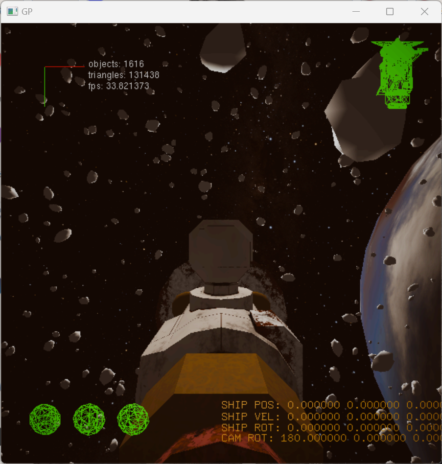
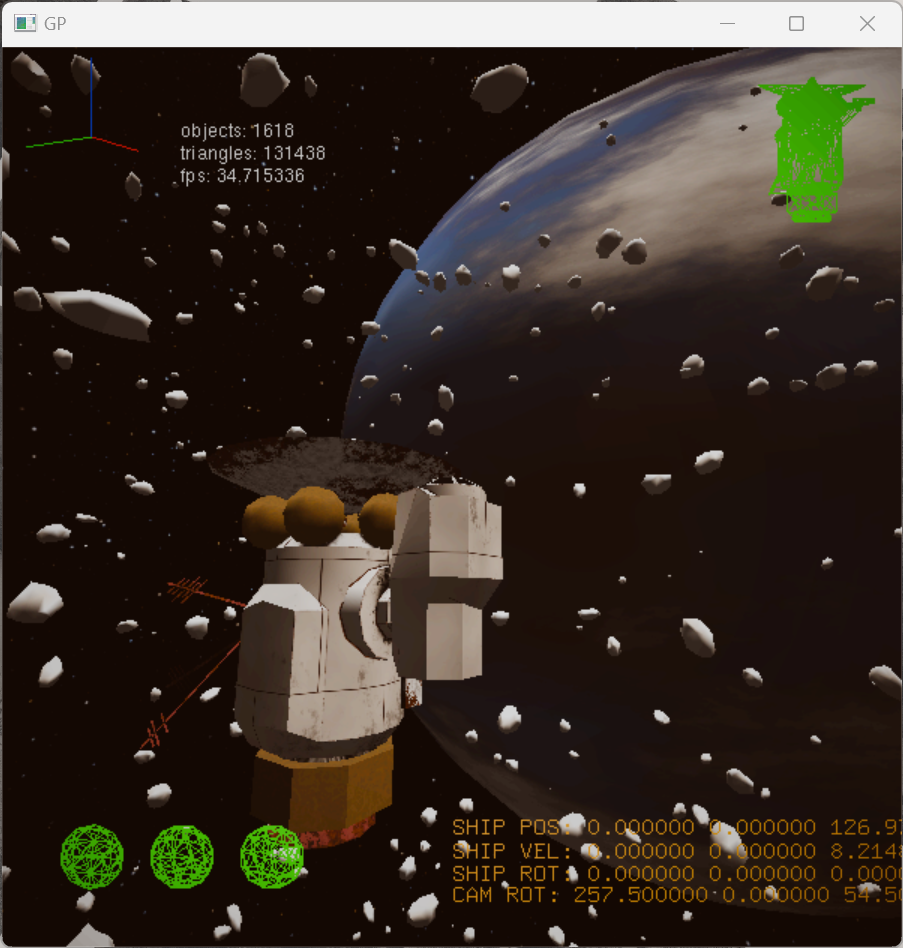
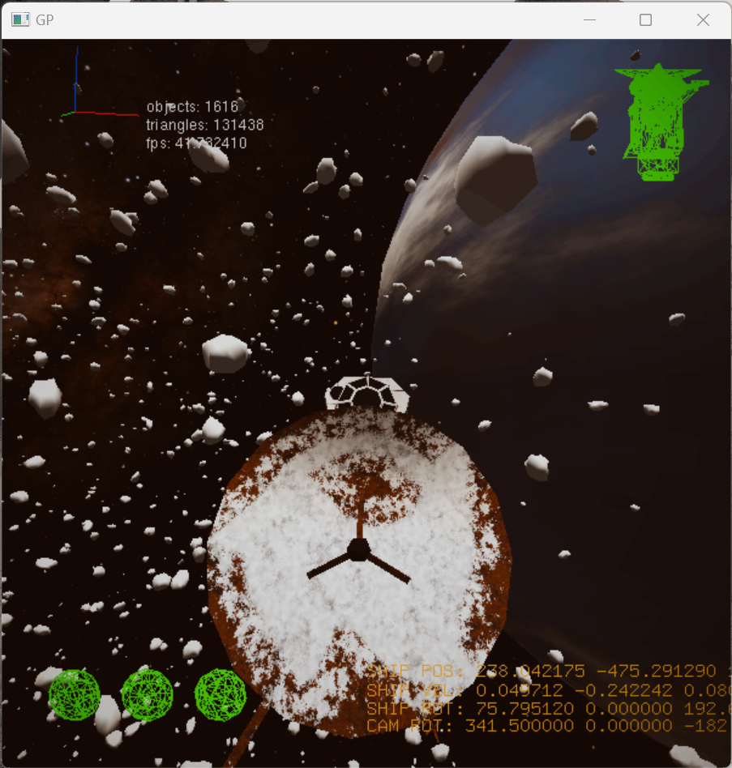
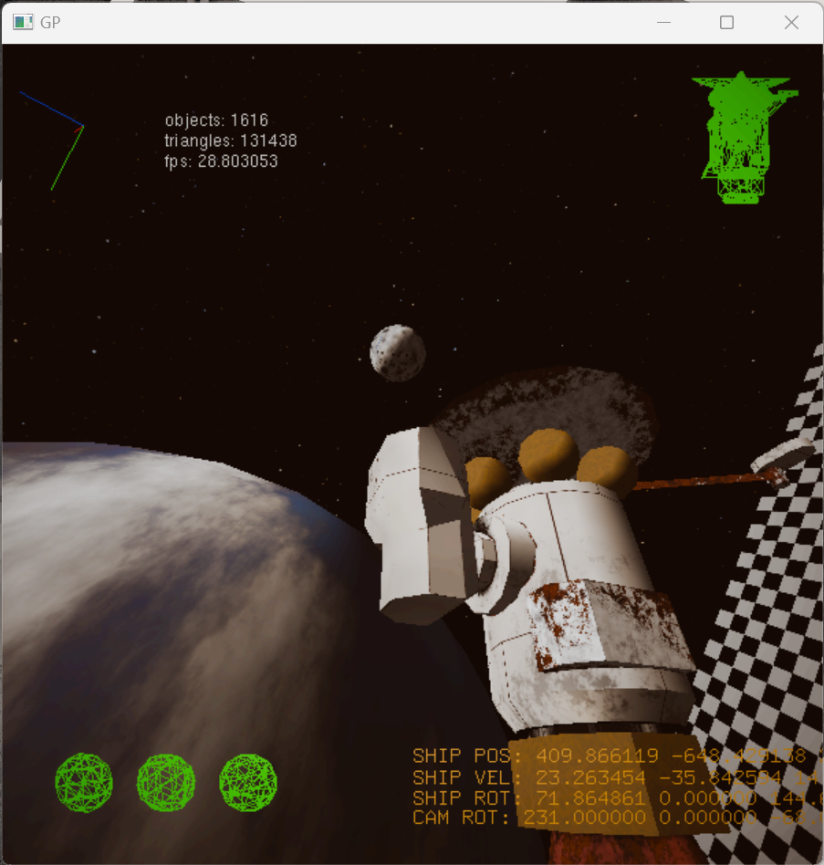
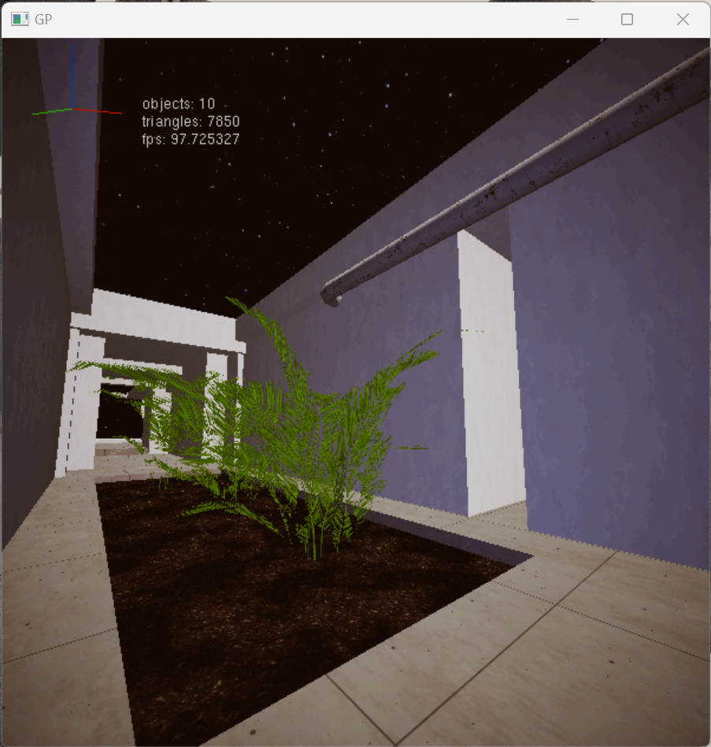
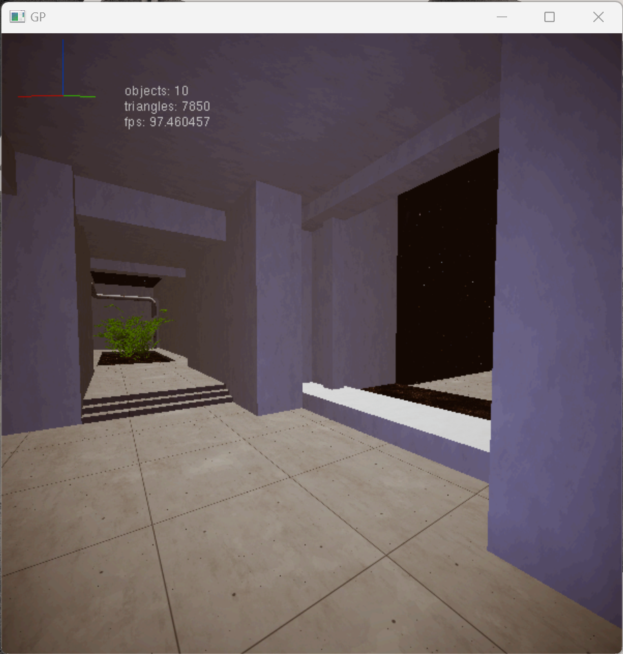
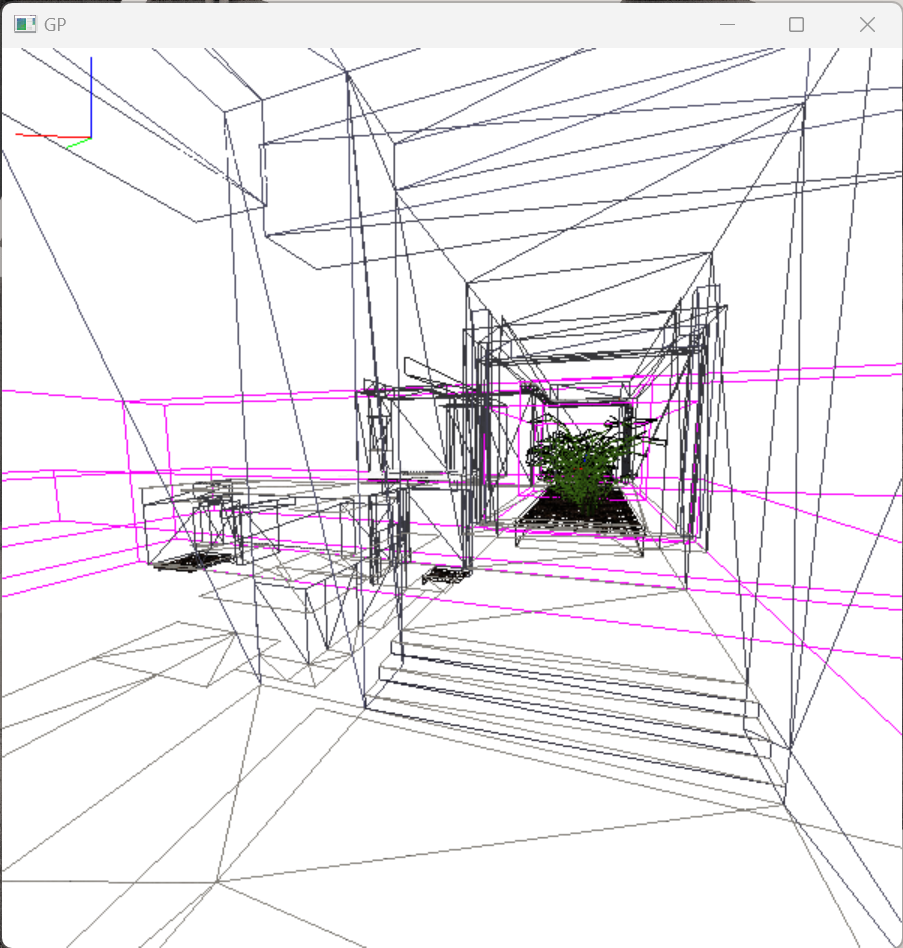
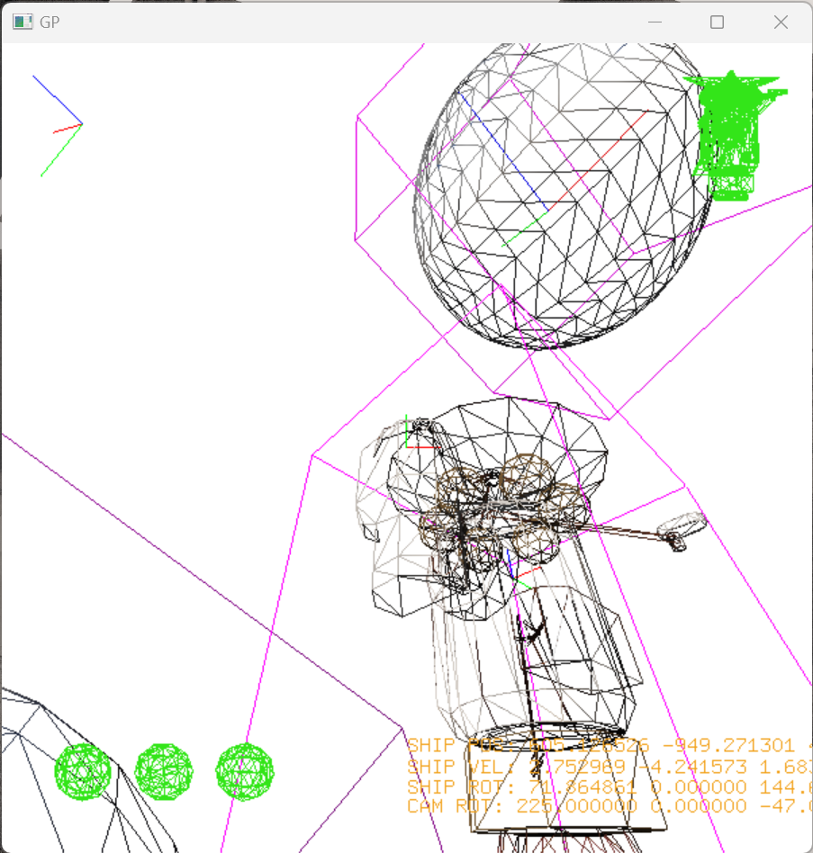
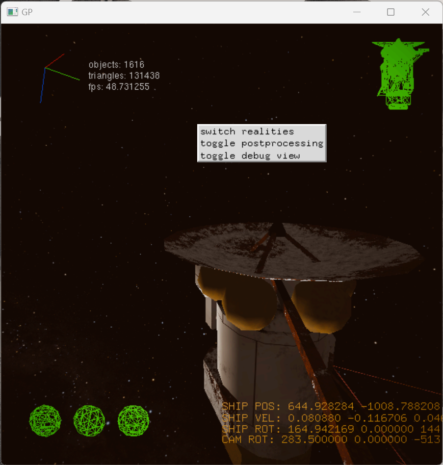

# Space Game - Graphics Programming Assignment
This graphical demo presents two different scenes in a very simple 3D engine. Key features are described below.

## Key Features
- 3D model loading from OBJ files (limited to triangle-faces and single material)
- 2D texture loading from BMP files (no support for compression)
- scene heirarchy
- simple particles
- two 3D scenes: 'orbiting a planet', and 'the museum'
- use of GLUT menus
- post-processing (CPU-bound due to OpenGL 1.x limitations)
- sampling of fixed size colour LUTs
- asteroid field generated using Mitchell's Best Candidate algorithm for evenly distributing points
- movable camera
- usage of lights
- usage of GLUT text (including counters for triangles, objects, and framerate)
- camera overlay (usable for e.g. GUI)
- textured skybox
- resizeable window
- debug mode (showing object wireframes, bounding boxes, and origins/axes)

## Sources
All models I created in blender.
The starry sky backdrop is taken from NASA's Deep Star Map [https://svs.gsfc.nasa.gov/4851/].
All other textures I created using blender, GIMP and Krita.

## Screenshots

'Orbiting a planet' scene.

The planet is visible through the asteroid field.

Another view of the spaceship. Notice the green overlay objects (animated), and text detailing the position, rotation, and velocity of the spaceship.

Outside the asteroid field, and the moon is visible orbiting the planet.

From the corner of 'the museum' scene. It isn't much of a museum, I ran out of time for adding more details.

In the museum scene, a second light is added, a blue light centered on the player.

There is an option to toggle on debug mode.

Debug mode in 'Orbiting a planet', with the moon visible in the top right.

The menu can be brought up using right-click.

## Controls
In 'Orbiting a planet':
- W/S pitch ship up/down
- A/D yaw ship left/right
- E/Q decelerate ship
- Drag mouse - orbit camera around ship
- Right click - show menu
In 'The museum':
- WASD to move relative to view direction, E/Q to move up and down
- Drag mouse - pan camera
- Right click - show menu

The menu can be used to toggle debug mode on/off, toggle post-processing on/off, and switch between the two scenes.
